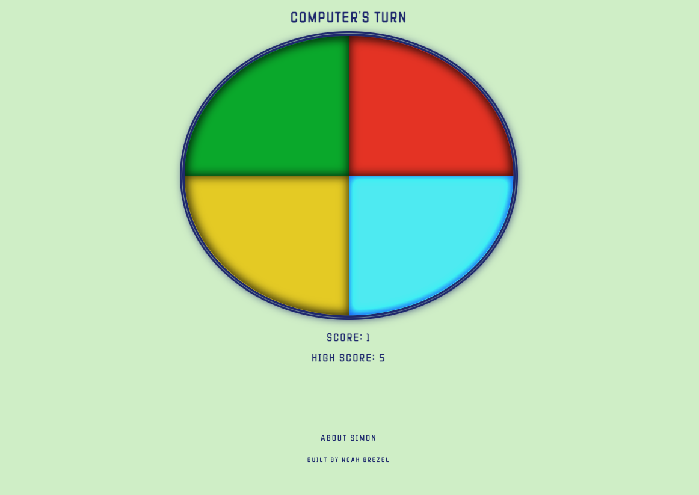
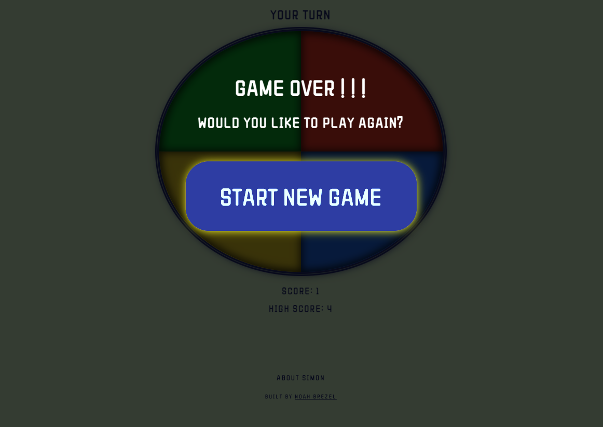

# SIMON
### Based on the **[classic handheld game](https://shop.hasbro.com/en-us/product/simon-game:6B0A06E3-5056-9047-F532-6A891FAEBA15)** of the same name, SIMON is a simple, one-person puzzle.

---
## Motivation
#### I love puzzles and games, and really enjoyed the last game I built, so I decided to recreate a digital version of it. Side note, this has proved to be a helpful way for my five-year-old daughter to learn how to use a mouse.

---
## User Stories & Wireframes

#### Each round, the computer adds one lit section to its pattern, and you try to repeat the pattern in order. One mistake and the game is over!!
#### Each colored section has its own sound effect, so you can remember the pattern either by sight or by sound. Game tracks your current and high scores, though the high score is lost once you navigate away from the game (didn't think this warranted a login to store that).


#### * Game screenshot: 

####  
####  


---

## Technologies & Code Snippets
#### * HTML, CSS, SASS, JavaScript

#### Probably the hardest thing about this project was getting the lights/sounds to turn on and off in order. The second section shouldn't light up until the first section had turned off. After playing around with various asyncronous approaches, I realized that a toggle coupled with setInterval, setTimeout and an incremented variable would work. 
#### * Sample code:
#### 
```    
const toggleLight = (idx) => {
   let selection = document.getElementById(`${idx}`)
   selection.classList.toggle('lit')
}
// light up and turn off one game section
const lightUpSection = (idx, interval) => {
   let intervalId = setInterval(() => {
      toggleLight(idx)
      playSound(idx)
      setTimeout(() => {
         toggleLight(idx)
      }, base / 2)
   }, interval)
   // allow access to intervalId outside of function:
   globalIntervalId = intervalId
   setTimeout(() => {
      clearInterval(intervalId)
   }, interval)
}
// light up each section in compPattern
const lightUpCompPattern = (interval) => {
   for (let i in compPattern) {
      lightUpSection(compPattern[i], interval)
      interval += base;
      // allow access to incremented interval outside of function:
      globalInterval = interval
   }
}
```

---

### Game can be seen **[here.](https://noahbrezel.com/simon/)**

---

## Future development:
#### Possibly getting the scores to be integrated into the gameboard (on a non-clickable circle in the center of the gameboard).
